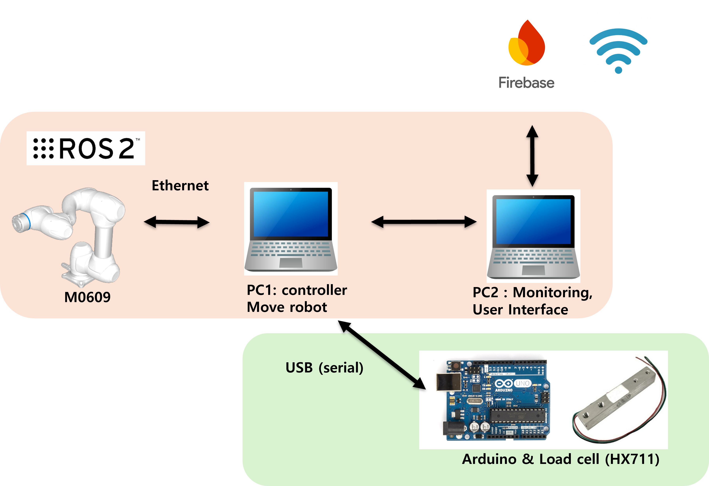
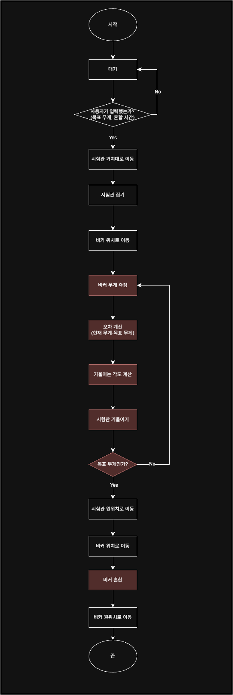

# Co-Lab: 스마트 랩 액체 혼합 자동화 시스템
> **조 이름:** E-1 - ROKEY
> **팀원:** [곽문정_정진태_이정현]

## 1. 시스템 설계 및 플로우 차트
프로젝트의 전체적인 구조와 소프트웨어 흐름도입니다.

### 1-1. 시스템 설계도 (System Architecture)
<p align="center">
  
</p>
**설명: 두산 로봇 매니퓰레이터(m0609), 아두이노 로드셀, Firebase DB, 웹 UI 간의 ROS2 통신 및 제어 구조를 나타냅니다.**

### 1-2. 플로우 차트 (Flow Chart)
<p align="center">
  
</p>
**설명: UI 명령 입력부터 Transfer(이동), Pouring(붓기), Mixing(혼합), Return(복귀) 및 충돌 감지/복구(Safety/Recovery) 프로세스 진행도를 나타냅니다.**

---

## 2. 운영체제 환경 (OS Environment)
이 프로젝트는 다음 환경에서 개발하였습니다.

* **OS:** Ubuntu 22.04 LTS
* **ROS Version:** ROS2 Humble
* **Language:** Python 3.10, HTML/JS
* **IDE:** VS Code

---

## 3. 사용 장비 목록 (Hardware List)
프로젝트에 사용된 주요 하드웨어 장비입니다.

| 장비명 (Model) | 수량 | 비고 |
|:---:|:---:|:---|
| Doosan 매니퓰레이터 (m0609) | 1 | 자체 툴(GripperDA_v1) 장착 |
| 아두이노 및 로드셀 | 1 | 무게 측정용, 시리얼 통신(/dev/ttyACM0) |
| 교반기 (Mixer) | 1 | |
| 비커 및 시험관 | 다수 | Large, Small 사이즈 |

---

## 4. 의존성 (Dependencies)
프로젝트 실행에 필요한 라이브러리 및 패키지입니다.

* Python >= 3.10
* rclpy, std_msgs
* firebase_admin
* pyserial (serial)
* Doosan Robot ROS2 Package (DSR_ROBOT2)

---

## 5. 실행 순서 (Usage Guide)
프로젝트를 실행하기 위한 순서입니다. 터미널 명령어를 순서대로 입력해 주십시오.

### Step 1. 로봇 초기화
로봇의 전원을 켜고 ROS2 통신 환경을 연결합니다.
```bash
ros2 launch dsr_bringup2 dsr_bringup2_rviz.launch.py mode:=real host:=192.168.1.100 port:=12345 model:=m0609
```

### Step 2. 하위 제어 및 모니터링 노드 실행
각 터미널 탭을 열어 개별 노드를 실행합니다.


```bash
# 로드셀 드라이버
ros2 run colab_pkg scale

# 안전 모니터링 및 복구 노드
ros2 run colab_pkg safety_monitor
ros2 run colab_pkg task_recovery

# 작업 수행 노드
ros2 run colab_pkg transfer
ros2 run colab_pkg pour
ros2 run colab_pkg mixing

# UI 및 DB 연동 노드
ros2 run colab_pkg ui
```


### Step 3. 메인 시스템 컨트롤러 실행
최상위 제어 컨트롤러를 실행하여 시스템을 대기 상태로 만듭니다. 이후 웹 UI(ui_ver2.html)를 통해 작업을 명령합니다.


```bash
ros2 run colab_pkg ctrl

```